1. Untuk mempersiapkan pembangunan The Wired, Lain yang berperan sebagai Router membuat tiga Switch/Gateway: Switch 1 menuju dua Entitas yaitu Alice dan Mika, Switch 2 menuju Chisa, sedangkan Switch 3 menuju Knights dan Eiri. Kelima Entitas tersebut dikonfigurasi sebagai Client di GNS3. [GUNAKAN PREFIX IP MASING-MASING KELOMPOK]


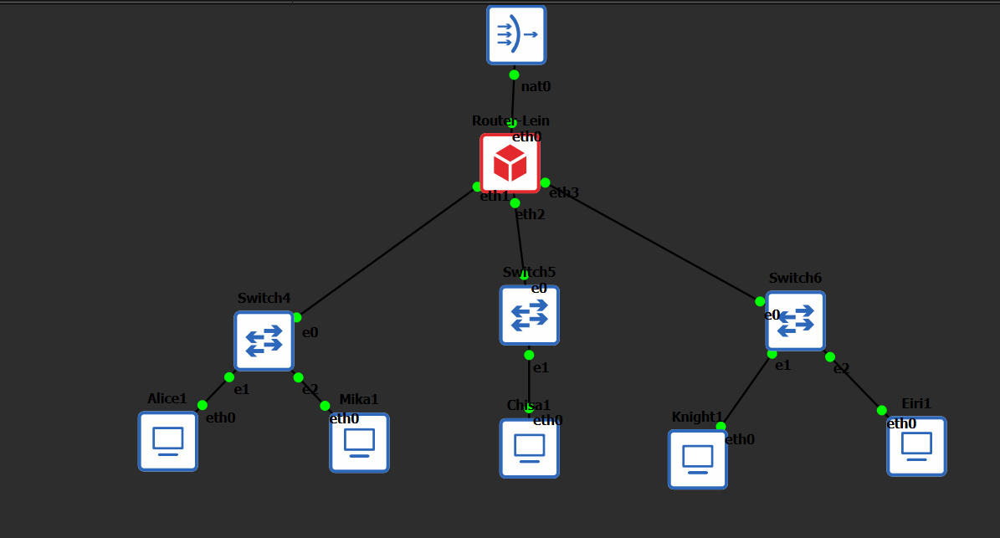

setiap client dan Router disetup dengan file konfigurasinya masing masing.

2. Karena menurut Lain pada saat itu The Wired masih terisolasi dari dunia luar, konfigurasikan router Lain agar dapat tersambung langsung ke jaringan internet publik melalui NAT/DHCP pada interface eth0.

Pada Gambar langkah ke-1, dapat dilihat saya sudah menyambungkan Router Lein ke NAT langsung.

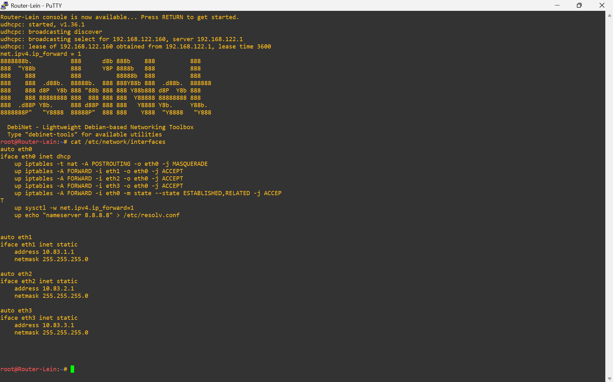
Berikut adalah foto konfigurasi dari Router_Lein

3. Setelah router Lain terhubung ke internet, pastikan seluruh Entitas (Client) di bawah Switch 1, Switch 2, dan Switch 3 dapat saling terhubung dan berkomunikasi satu sama lain melalui konfigurasi routing.

Berikut adalah konfigurasi Router Lein : 
```bash
auto eth0
iface eth0 inet dhcp
    up iptables -t nat -A POSTROUTING -o eth0 -j MASQUERADE
    up iptables -A FORWARD -i eth1 -o eth0 -j ACCEPT
    up iptables -A FORWARD -i eth2 -o eth0 -j ACCEPT
    up iptables -A FORWARD -i eth3 -o eth0 -j ACCEPT
    up iptables -A FORWARD -i eth0 -m state --state ESTABLISHED,RELATED -j ACCEPT
    up sysctl -w net.ipv4.ip_forward=1
    up echo "nameserver 8.8.8.8" > /etc/resolv.conf
```
Dapat dilihat kalau <code>sysctl -w net.ipv4.ip_forward=1</code> Sudah terpakai, hal ini mewujudkan komunikasi antar device di dalam satu subnet yang sama.

Dan berikut adalah Bukti setiap device dapat berkomunikasi antara satu dengan yang lain : 
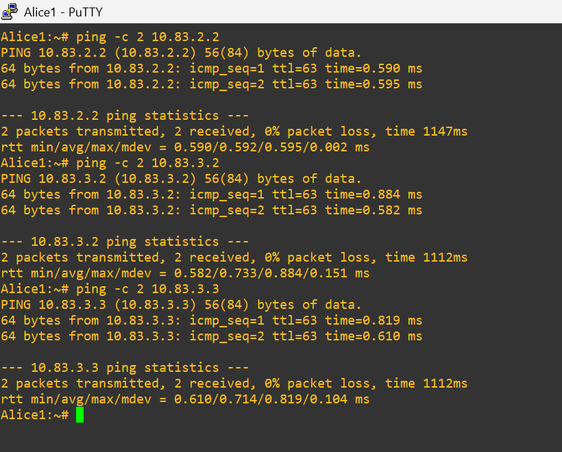
Dapat terlihat dengan jelas Client Alice di switch 1 dapat berkomunikasi dengan device di switch lain.

Lalu mari kita uji dengan Mika : 
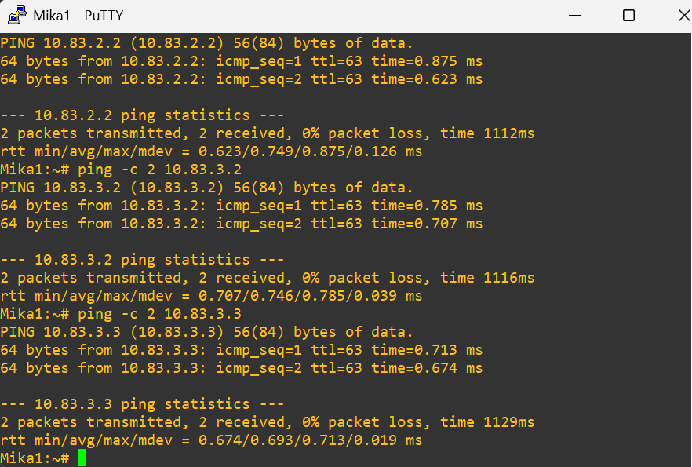
Terlihat Jelas Client Mika juga dapat berkomunikasi dengan device di switch lain.


4. Lain ingin agar setiap Entitas (Client) memiliki kemandirian di The Wired. Konfigurasikan firewall/iptables (NAT Masquerade) dan DNS resolver agar setiap Client dapat terhubung ke internet secara mandiri (dapat melakukan ping ke 8.8.8.8 dan membuka domain web google.com).

Konfigurasi Router Lein pada langkah 3 sudah melakukan konfigurasi iptables dan DNS resolver. Lalu agar setiap client dapat melakukan ping ke google kita bisa menambahkan :
```bash
    up echo "nameserver 8.8.8.8" > /etc/resolv.conf
```
di Router Lein, Alice, Mika, Chisa, Knight, dan Eiri

5. Eiri tetap berupaya menanamkan kekacauan ke dalam jaringan. Untuk mengantisipasi restart tiba-tiba, pastikan seluruh konfigurasi jaringan tidak hilang saat semua node di-restart. Buat script verifikasi di /root/cek_status.sh pada router Lain yang menampilkan ringkasan interface (ip -br a) dan status tabel NAT (iptables -t nat -L -v -n) setelah reboot.


```bash
#!/bin/bash

echo "============================= RINGKASAN INTERFACE ================================="
ip -br a
echo "=============================== STATUS TABEL NAT  ================================="
iptables -t nat -L -v -n

```

Berikut Output : 
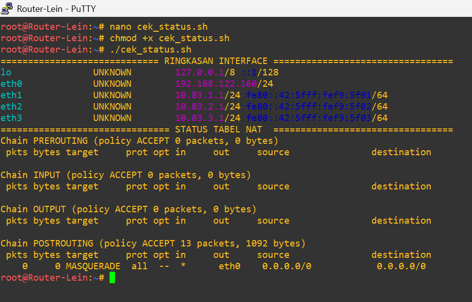

6. Mika mencurigai adanya anomali traffic pada segmen jaringannya. Jalankan generator traffic berikut (link file) pada node Mika, lalu lakukan packet sniffing menggunakan Wireshark pada interface node Mika. Terapkan display filter khusus untuk menyaring paket yang berprotokol DNS atau ICMP. Tunjukkan screenshot hasil filter beserta ringkasan paket yang lolos.

Setup 
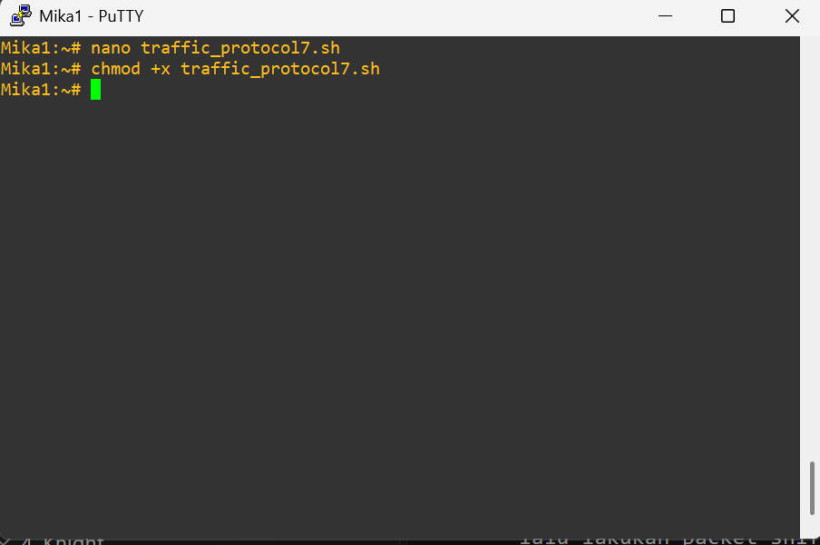

Melakukan Capture Traffic: 
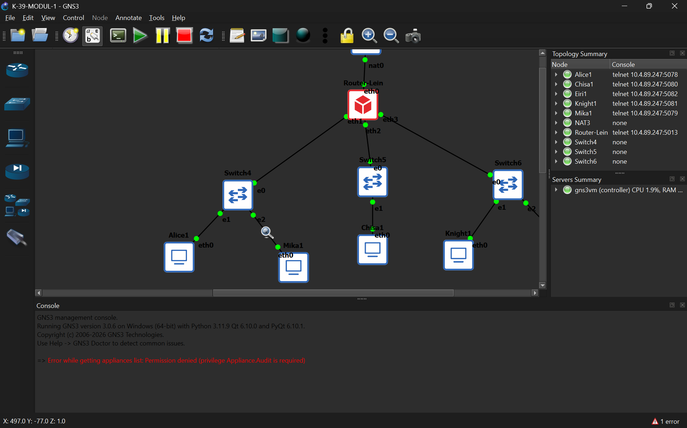

Menjalankan script : 
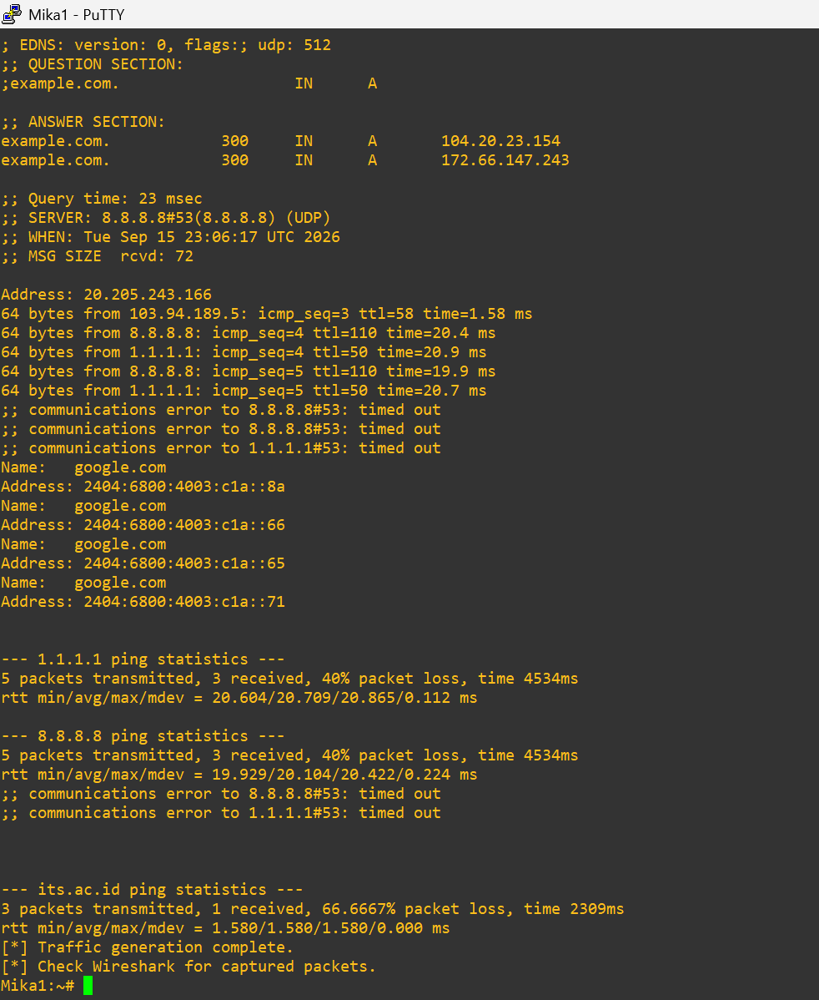

Hasil Capture : 
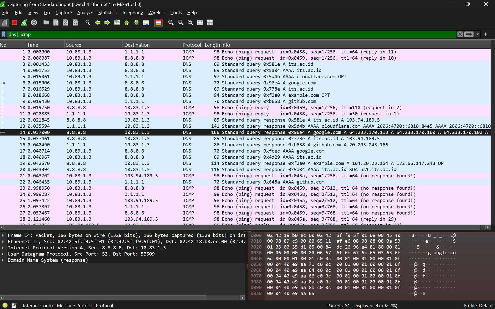

Berdasarkan hasil Wireshark : 
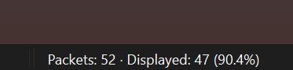

Ada 47 paket yang lolos filter dari 52 paket. Dan paket loss pada gambar Menjalankan script :
```bash
--- 1.1.1.1 ping statistics ---
5 packets transmitted, 3 received, 40% packet loss, time 4534ms
rtt min/avg/max/mdev = 20.604/20.709/20.865/0.112 ms

--- 8.8.8.8 ping statistics ---
5 packets transmitted, 3 received, 40% packet loss, time 4534ms
rtt min/avg/max/mdev = 19.929/20.104/20.422/0.224 ms
;; communications error to 8.8.8.8#53: timed out
;; communications error to 1.1.1.1#53: timed out


--- its.ac.id ping statistics ---
3 packets transmitted, 1 received, 66.6667% packet loss, time 2309ms
rtt min/avg/max/mdev = 1.580/1.580/1.580/0.000 ms
[*] Traffic generation complete.
[*] Check Wireshark for captured packets.
```

7. Chisa memutuskan mendirikan FTP Server pada node miliknya dengan shared folder di /var/wired/data. Terapkan kebijakan akses: user alice (hak akses read & write), user mika (dibatasi read-only), dan user eiri (dibatasi tanpa izin akses / blacklist). Buktikan konfigurasi dengan membuat file signal_alice.txt dari user alice, dan buktikan penolakan akses saat user eiri mencoba login.

    Pada langkah ke-7, kami perlu  mengganti semua client menjadi debinet karena keperluan yang perlu akses lebih luas.

    Setup : 
    Setup dilakukan di Node Chisa untuk server. 
    Lalu di setiap client dilakukan setup juga untuk melakukan testing. 

    Berikut hasil testing : 
    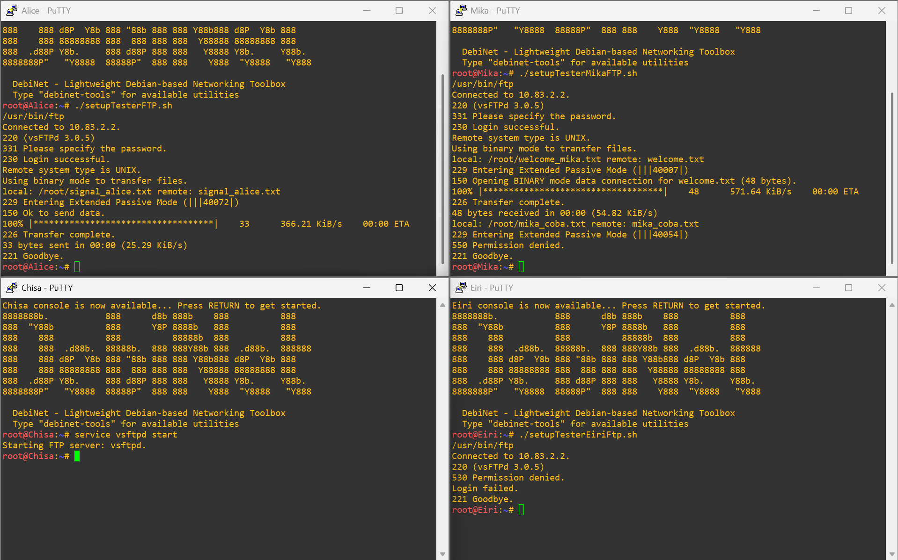

    - Alice dapat melakukan put dengan kode feedback 260. 
    - Mika tidak dapat melakukan uploud dengan kode permision denied 550
    - Eiri tidak dapat melakukan login dengan kode perimision denied 530


8. Kelompok rahasia Knights perlu mengirimkan dokumen laporan intelijen ke FTP Server Chisa. Lakukan koneksi FTP client dari node Knights ke FTP Server Chisa menggunakan akun alice. Upload file berikut (link file). Analisis sesi Wireshark dan sebutkan: perintah FTP untuk upload (STOR), kode status sukses server (226), dan port data TCP yang dinegosiasikan pada mode PASV.

    Melakukan capture jaringan : 
    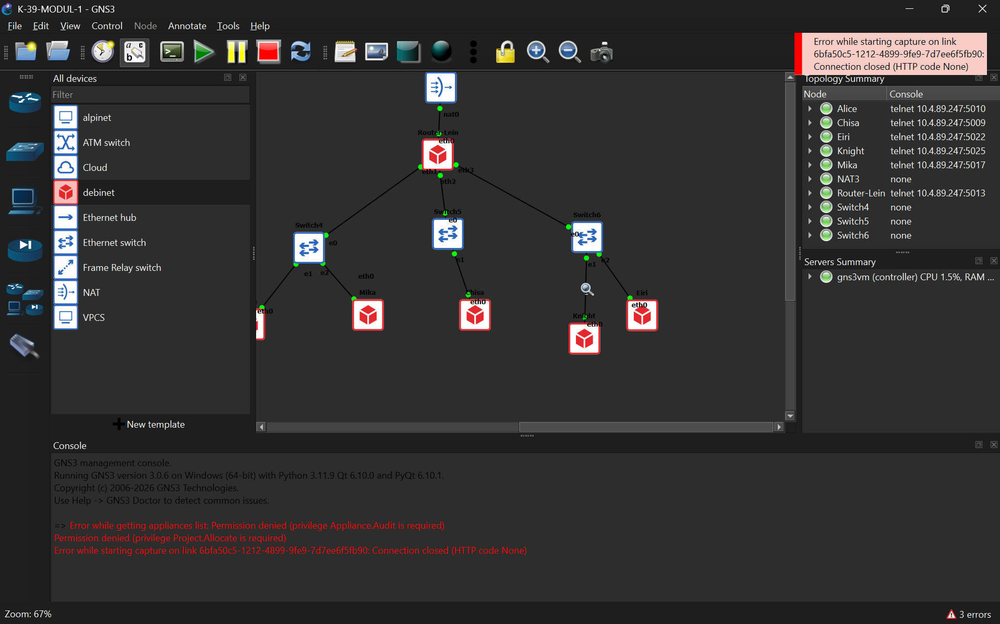


    Hasil Menjalankan Script :
    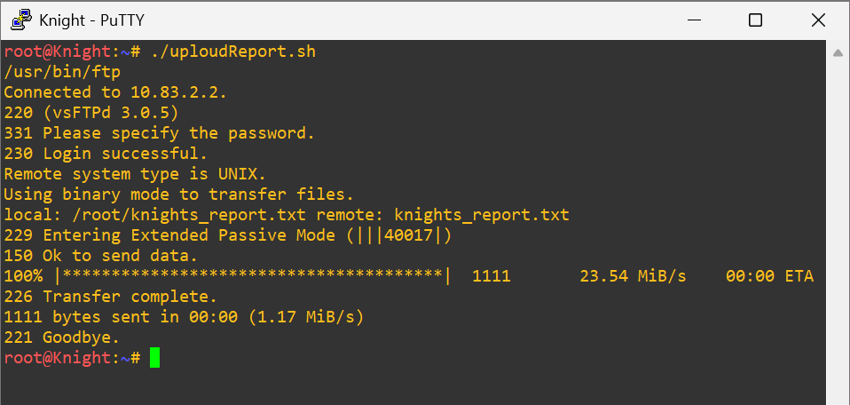
    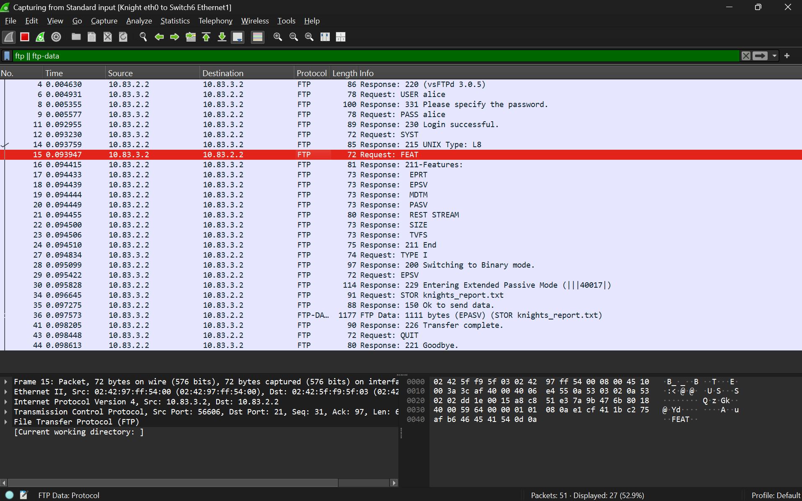

    Dapat dilihat bahwa Uploud file berhasil dengan perintah FTP <im> STOR</im>, kode status sukses sukses juga ditemukan (226) denga pesan Transfer Complete, dan port yang dinegosiasikan adalah 40017.

    Port yang dinegosiasikan berada di rentang yang telah ditentukan saat configurasi server ftp, yaitu 40000--40100.
    ```bash 
    .
    .
    pasv_enable=YES
    pasv_min_port=40000
    pasv_max_port=40100
    .
    .

    Potongan Code di SetupServerFTP.sh pada node Chisa
    ```

9. Mika mengakses dokumen Protokol Tujuh di (link file) dari FTP Server Chisa. Dari node Mika, unduh file tersebut menggunakan akun mika. Setelah itu, buktikan pembatasan read-only dengan mencoba mengunggah file baru dari akun mika, dan tunjukkan pesan error respon server (error 550 Permission denied) saat mika mencoba melakukan upload.

    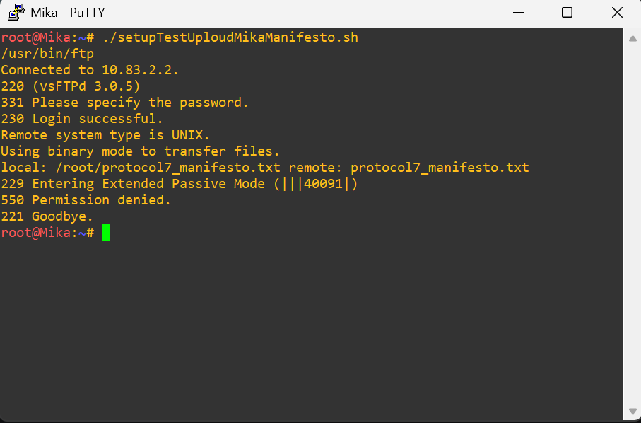

    Uploud ke server Chisa tidak berhasil dengan kode permission denied 550.

10. Knights melancarkan uji ketahanan koneksi ke server Chisa untuk menguji latensi jaringan The Wired. Kirimkan paket ping dari node Knights ke node Chisa dengan payload khusus 128 bytes dan interval 0.3 detik sebanyak 77 paket (ping -c 77 -s 128 -i 0.3 <IP_Chisa>). Buka Wireshark, catat nilai ICMP Type dan Code untuk Echo Request vs Echo Reply, serta analisis packet loss dan RTT (min/avg/max).


    Melakukan capture traffic jaringan Knight : 
    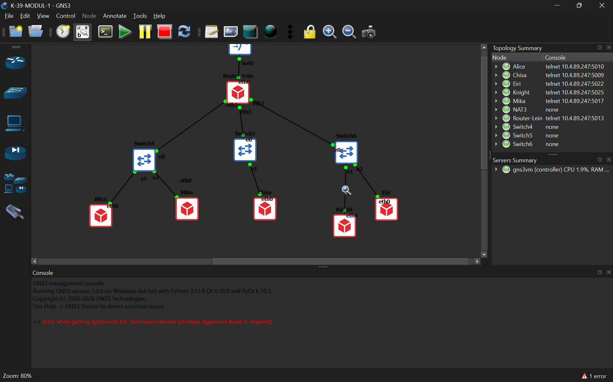

    Hasil Setelah dijalankan : 
    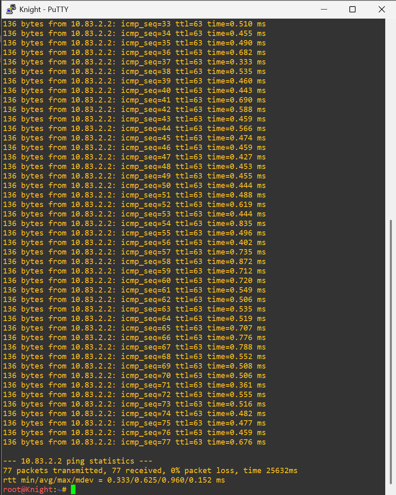
    Nilai Packet Lost 0 menandakan koneksi stabil dengan RTT :
    ```bash
        rtt min/avg/max/mdev = 0.333/0.625/0.960/0.152 ms
    ```
    - min = 0.333 ms
        Menandakan kecepatan pengiriman tercepat dalam 77 paket adalah 0.33ms
    - avg = 0.625 ms
        Menandakan kecepatan pengiriman rata-rata dalam 77 paket adalah 0.625ms
    - max = 0.960 ms
        Menandakan kecepatan pengiriman terlambat dalam 7 paket adalah 0.960ms
    - mdev = 0.152 ms (Mean deviation / jitter)
        Menandakan variasi kecepatan paket terhadap nilai rata-ratanya, gampangnya ini fluktuasi jaringan antara stabil atau tidak.

        Angka 0.152 ms menandakan koneksi antara knight dan Server Chisa sangat stabil, terbebas dari fluktuasi lag.

    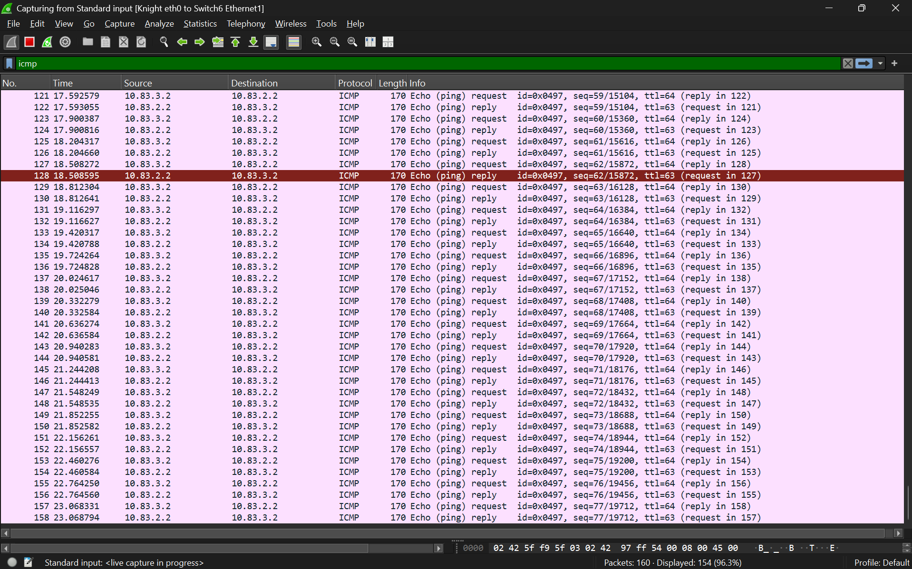

    Nilai ICMP : 
    - Type dan Code Request 
        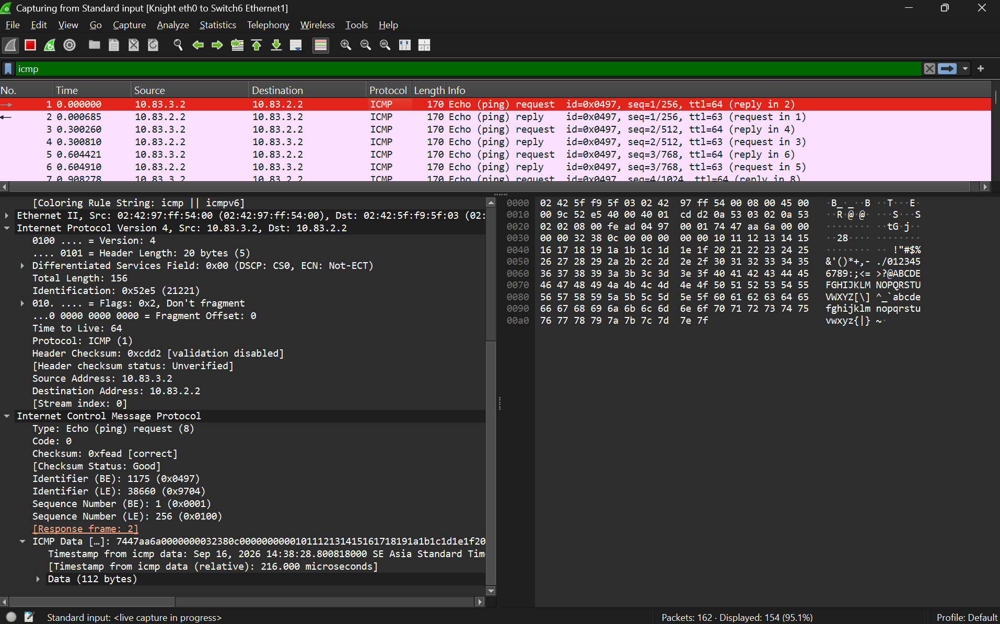
        <im>Type (8) dan Code (0)</im>
    - Type dan Code Reply
        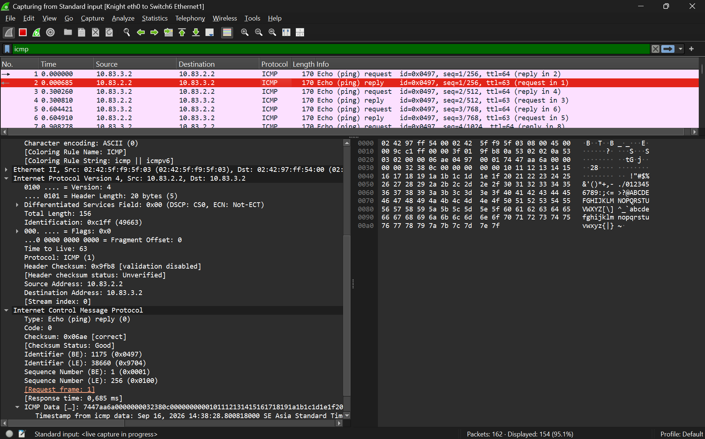
        <im>Type (0) dan Code (0)</im>

11. Buktikan kelemahan protokol Telnet dengan membuat akun phantom_user dan password wired_ghost pada layanan telnetd di node Chisa. Lakukan login Telnet dari node Eiri ke node Chisa dan tangkap sesi menggunakan Wireshark. Tunjukkan kredensial plain text melalui fitur Follow TCP Stream, serta jelaskan mengapa setiap karakter terkirim dalam paket TCP terpisah.

    Melakukan Capture Wireshark : 
    

    Login Telnet :
    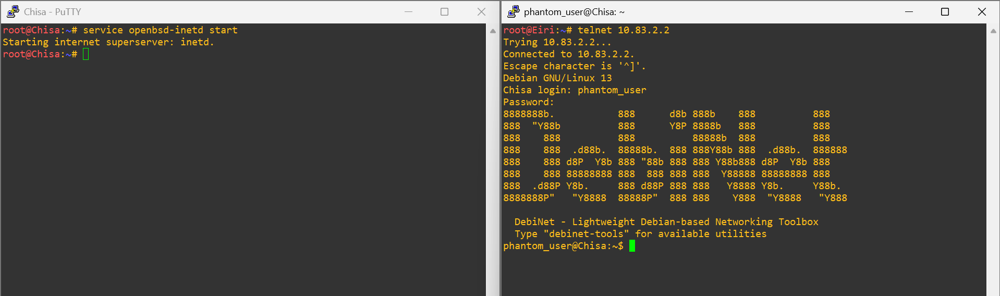

    Melakukan FOllow TCP Stream : 
    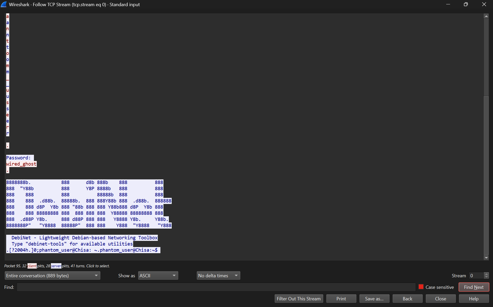

    Hasil Rat : 
    ```bash
    ..&..&........... ..!.."..'...
    ..'..&..&........... ..!..".....'...
    ....T.2....'...
    ..%
    ..%
    ..#
    ..#
    .. .....'.........
    .. .38400,38400....'.......XTERM..
    ...
    ...
    ...
    ...
    Debian GNU/Linux 13
    ..Chisa login: 
    p
    p
    h
    h
    a
    a
    n
    n
    t
    t
    o
    o
    m
    m
    _
    _
    u
    u
    s
    s
    e
    e
    r
    r

    .

    Password: 
    wired_ghost
    .

    8888888b.           888      d8b 888b    888          888
    888  "Y88b          888      Y8P 8888b   888          888
    888    888          888          88888b  888          888
    888    888  .d88b.  88888b.  888 888Y88b 888  .d88b.  888888
    888    888 d8P  Y8b 888 "88b 888 888 Y88b888 d8P  Y8b 888
    888    888 88888888 888  888 888 888  Y88888 88888888 888
    888  .d88P Y8b.     888 d88P 888 888   Y8888 Y8b.     Y88b.
    8888888P"   "Y8888  88888P"  888 888    Y888  "Y8888   "Y888

    DebiNet - Lightweight Debian-based Networking Toolbox
    Type "debinet-tools" for available utilities
    .[?2004h.]0;phantom_user@Chisa: ~.phantom_user@Chisa:~$ 

    ```
    Dapat dilihat bahwa Kita bisa mendapatkan informsai akun dan password secara gamblang dengan melakukan follow TCP stream di Wireshark


12. Alice mencurigai Knights menjalankan beberapa layanan rahasia di node-nya. Lakukan pemindaian port dari node Alice ke node Knights menggunakan Netcat (nc) untuk memeriksa port 22 (SSH) dan 80 (HTTP) dalam keadaan terbuka, serta port rahasia 7777 dalam keadaan tertutup. Analisis di Wireshark perbedaan TCP Flag yang dikembalikan antara port terbuka (SYN-ACK) dengan port tertutup (RST-ACK).

    Di sini kita sengaja membuka layanan port 22 dan 80 dengan menggunakan : 
    ```bash
    service ssh start
    service nginx start
    ```
    Ini dapat bekerja karena ssh berjalan di port 22 dan nginx berjalan di port 80.

    Melakukan Capture jaringan : 
    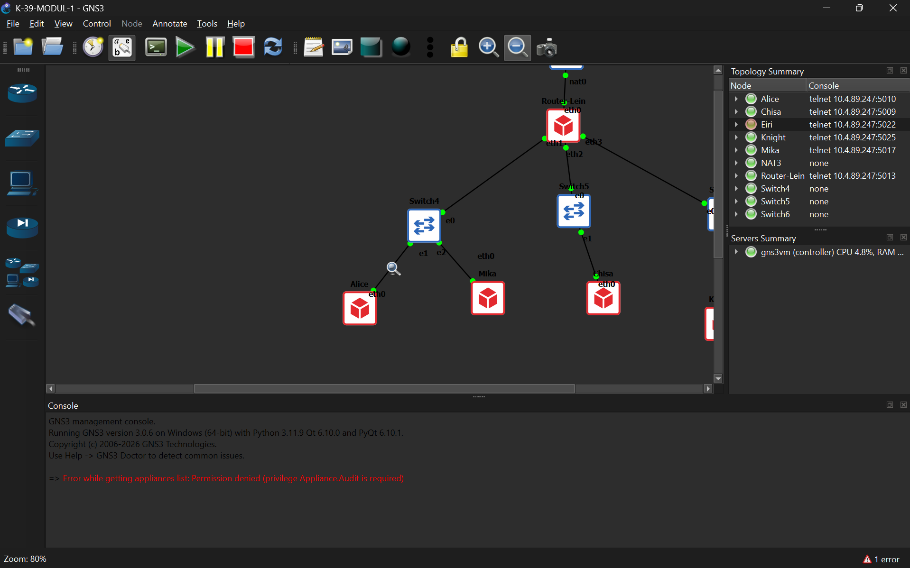

    Hasil Scanning :
    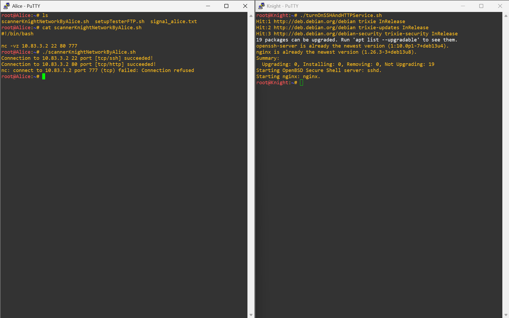

    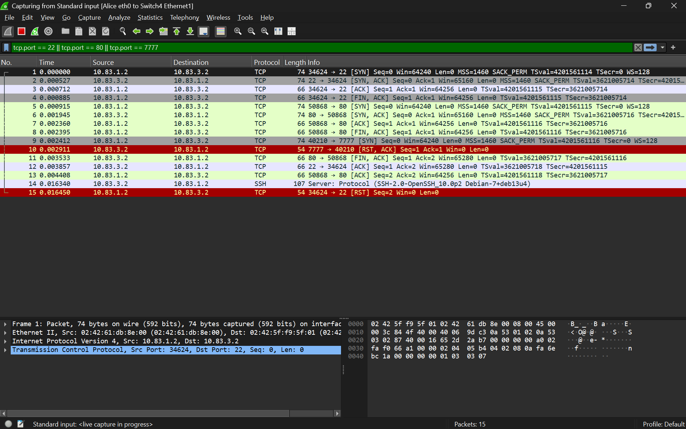

    Perbedaan TCP Flag untuk port Open dan Closed : 
    - TCP Port Open 

        Seperti pada gambar berikut saat port 22 dan 80 open :
        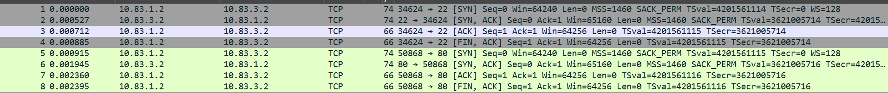

        Saat TCP Port Open terlihat dengan jelas terjadi three-way handshake.
        1. SYN
        2. SYN ACK
        3. ACK
        
        Lalu diakhiri flag <im>[FIN, Ack]</im> sebagai tanda kalau koneksi TCP sudah selesai dan Koneksi benar-benar selesai memberikan sinyal flag lagi <im> [ACK]</im>
        

    - TCP Port Closed
        Saat TCP Port Closed Sinyal Flag <im>SYN</im> dibalas dengan <im>RST, ACK</im> sebagai belasan.

        Sepert pada gambar berikut saat port 7777 closed : 
        

13. Lain memerintahkan agar administrasi jarak jauh menggunakan SSH secara aman tanpa password. Install OpenSSH server pada node Knights, buat pasangan kunci SSH (ssh-keygen) pada node Mika untuk user mika_admin, dan konfigurasikan public key authentication (PasswordAuthentication no). Lakukan koneksi SSH dari node Mika ke node Knights, tangkap sesi menggunakan Wireshark, identifikasi paket Protocol Version Exchange dan Key Exchange, serta jelaskan mengapa kredensial tidak terlihat dalam bentuk teks terbuka seperti pada Telnet.

    Melakukan setup Server, Client, dan Public key :
    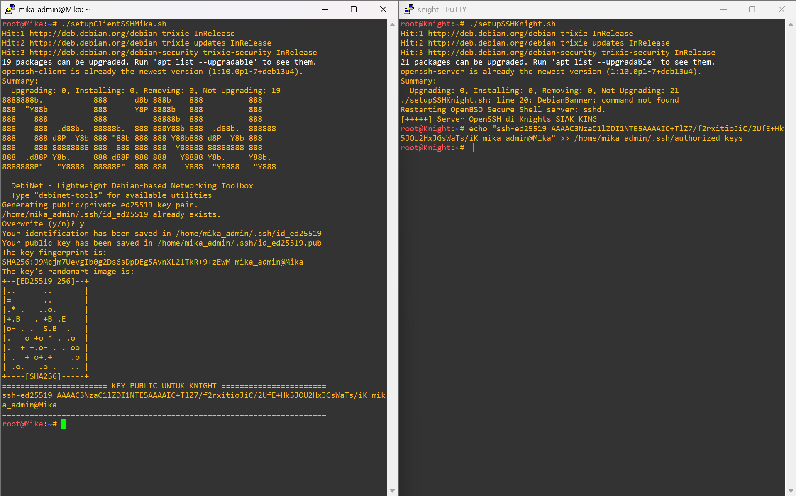

    Melakukan koneksi : 
    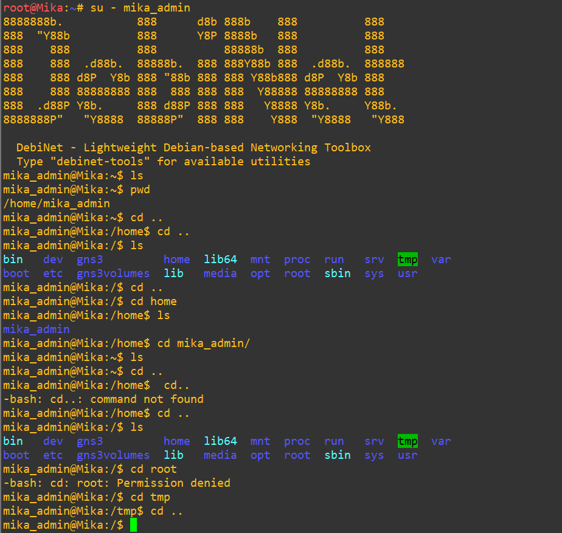

    Alasannya karena menggunakan encryption 
    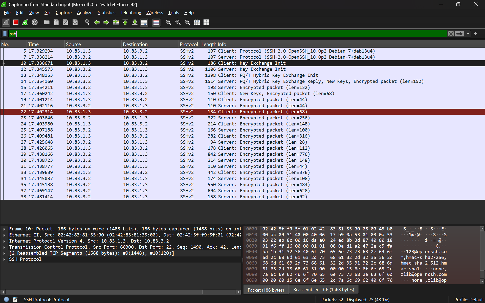

    Bisa dilihat pada gambar terlihat pada kolom info ada informasi bahwa koneksi dienkripsi
    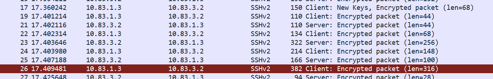
 
14. Setelah gagal mengakses FTP, Eiri melancarkan serangan brute-force terhadap form login web Alice. Analisis file capture wired_bruteforce.pcapng untuk mengidentifikasi alamat IP penyerang, target IP beserta port yang diserang, password user lain_admin yang berhasil ditembus, serta web server software dan versi yang dilaporkan pada response header. Validasi temuan kalian pada socket server

    Kita coba filter http dahulu : 
    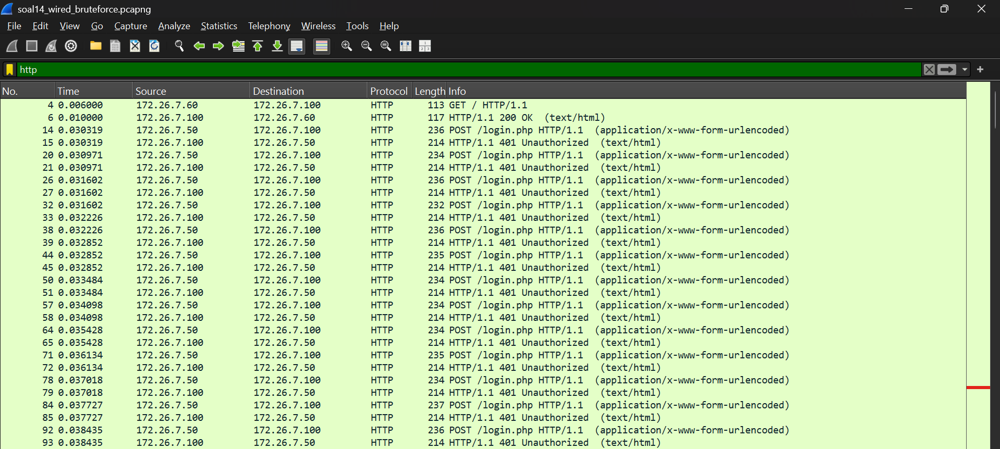
    Banyak sekali koneksi antara IP 172.26.7.50 dan 172.26.7.100, ini merupakan ciri khas serangan bruteforce. Lalu, karena 401 adalah kode yang dikirim ketika suatu login itu gagal. Kita bisa pakai filter http.response.code != 401 

    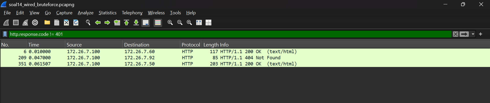
    Lakukan follow HTTP Stream pada destination IP 172.26.7.50 Lalu kalian akan mendapatkan password lein. 

    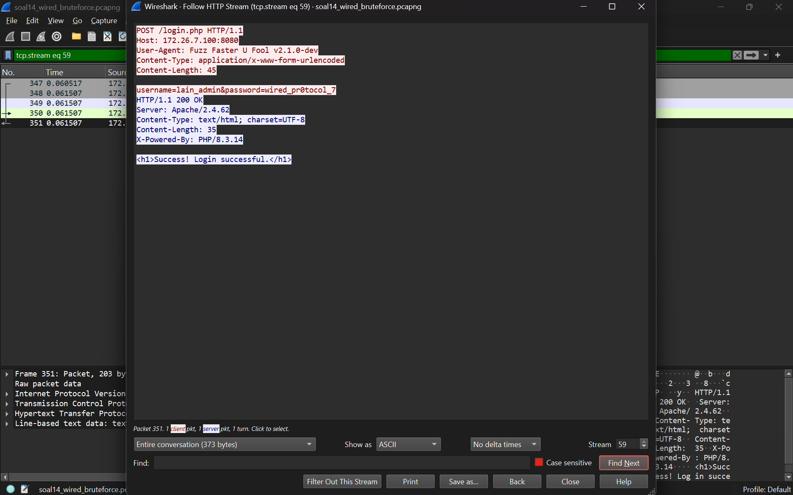
    Berdasarkan informasi di atas alamat Ip penyerang adalah 172.26.7.50

    Lalu masukkan semua informasi ke nc [ip_grout] 3401 sehingga mendapatkan flag : KOMJAR26{W1r3d_Brut3_sIkO9BhrmITH1ozv5ZfqTPCVZ}

    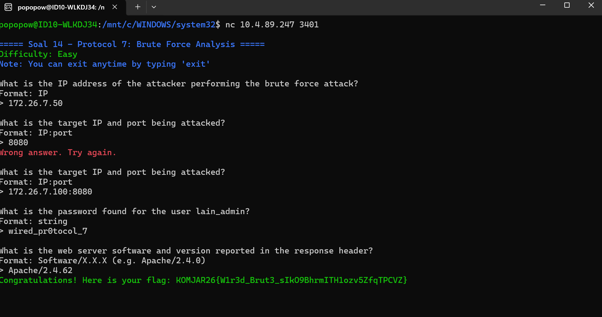
15. Eiri menyusup ke ruang server dan memasang perangkat keyboard USB berbahaya pada node Alice. Buka file capture wired_usb_hid.pcap, identifikasi Vendor ID dan Product ID perangkat USB dari deskriptor USB, alamat nomor device USB, serta pesan rahasia yang berhasil dicuri dari keystroke. Validasi temuan kalian pada socket server:

    Lakukan filter dengan usb.idVendor || usb.idPruduct 
    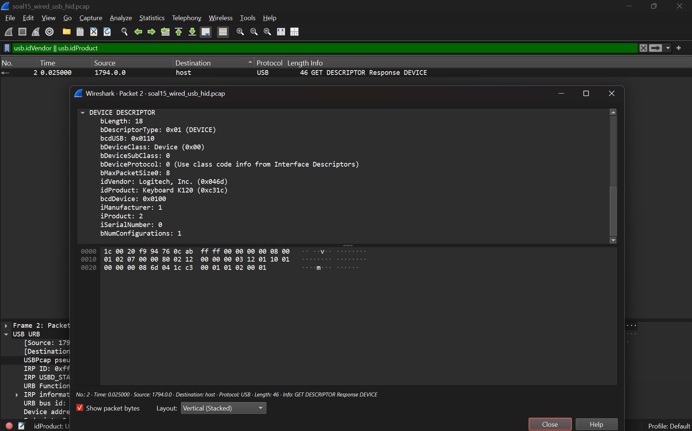

    Didapatkan : 
    - Vendor ID = 0x046d
    - Product ID = 0xc31c

    Lalu, untuk mendapatkan pesan rahasia yang berhasil dicuri dari keystroke, saya menggunakaan : 
    ```bash
    ┌──(kali㉿ID10-WLKDJ34)-[/mnt/c/Users/Popopow/Downloads]
    └─$ tshark -r soal15_wired_usb_hid.pcap -Y 'usb.capdata' -T fields -e usb.capdata > keystrokes.txt

    ┌──(kali㉿ID10-WLKDJ34)-[/mnt/c/Users/Popopow/Downloads]
    └─$ cat keystrokes.txt
    02001a0000000000
    0000000000000000
    00000c0000000000
    0000000000000000
    0000150000000000
    0000000000000000
    0000080000000000
    0000000000000000
    0000070000000000
    0000000000000000
    02002d0000000000
    0000000000000000
    0200130000000000
    0000000000000000
    0000150000000000
    0000000000000000
    0000120000000000
    0000000000000000
    0000170000000000
    0000000000000000
    0000120000000000
    0000000000000000
    0000060000000000
    0000000000000000
    0000120000000000
    0000000000000000
    00000f0000000000
    0000000000000000
    02002d0000000000
    0000000000000000
    0000240000000000
    0000000000000000
    02002d0000000000
    0000000000000000
    00000c0000000000
    0000000000000000
    0000160000000000
    0000000000000000
    02002d0000000000
    0000000000000000
    0000040000000000
    0000000000000000
    00000f0000000000
    0000000000000000
    00000c0000000000
    0000000000000000
    0000190000000000
    0000000000000000
    0000080000000000
    0000000000000000
    02002d0000000000
    0000000000000000
    00001f0000000000
    0000000000000000
    0000270000000000
    0000000000000000
    00001f0000000000
    0000000000000000
    0000230000000000
    0000000000000000
    ```

    Lalu, kita decode menggunakan solver.py yang sudah ada orang buat:
    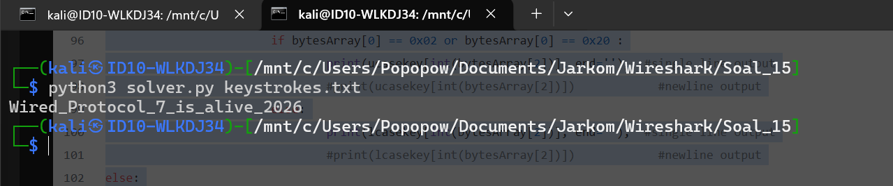
    <a href="https://blog.stayontarget.org/2019/03/decoding-mixed-case-usb-keystrokes-from.html"> Sumber Code Decode </a> 

    usb address yang dipakai adalah 7 : 
    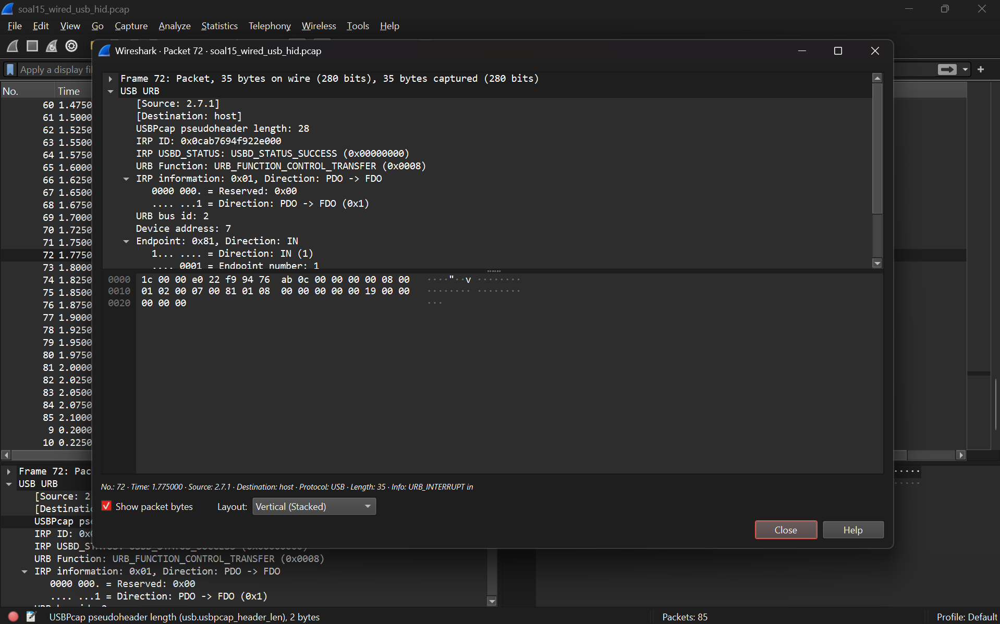

    Masukkan seluruh data dan anda akan mendapatkan flag : 
    KOMJAR26{USB_K3ystr0k3_zCaejtqhA6EB2fDvPp6ehpfQS}
    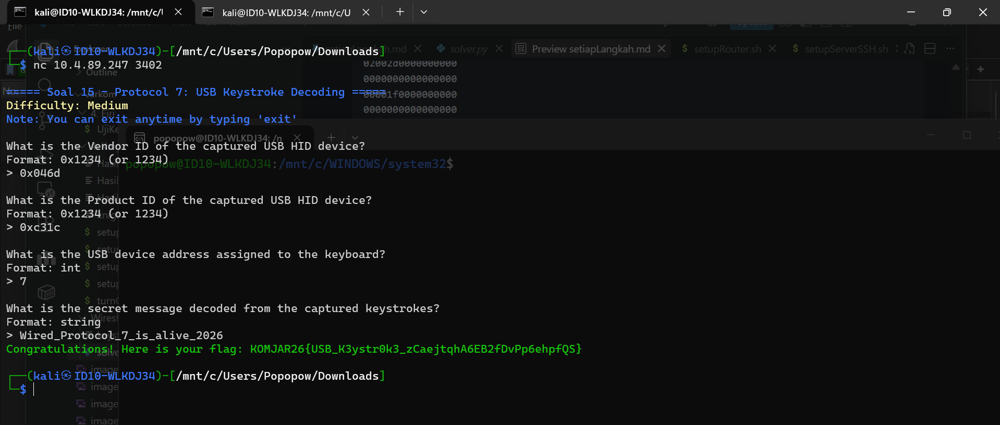


16. Eiri meletakkan file malware di server. Dari file capture wired_ftp_theft.pcap, lakukan analisis lalu lintas FTP untuk mengidentifikasi alamat IP server FTP penyerang, banner software FTP yang digunakan, kredensial login penyerang, serta ukuran (size in bytes) dari file malware knights_payload.exe yang diunduh. Validasi temuan kalian pada socket server:
	
    Pertama mari kita filter paket mana yang ada file "knight_payload.exe"
    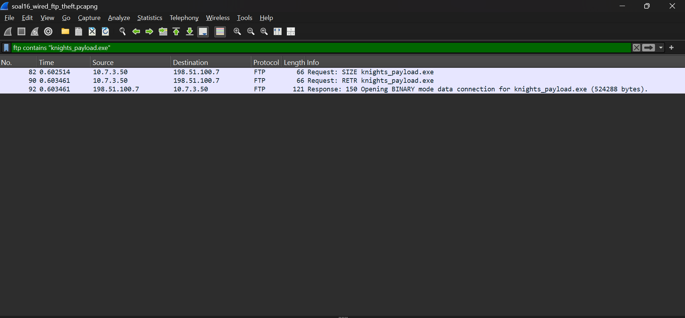

    Lakukan follow stream : 
    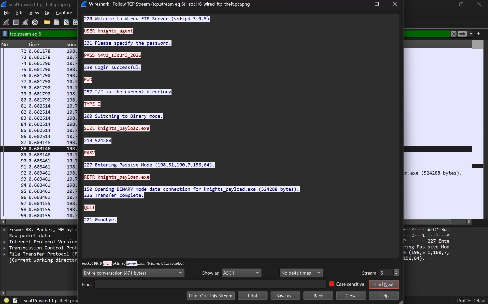

    Masukkan semua data : 
    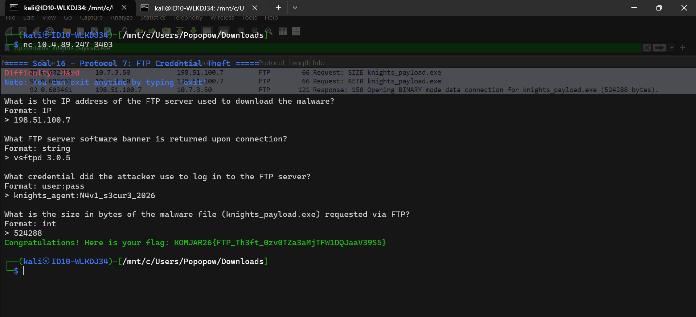

    Yeay dapat flag : KOMJAR26{FTP_Th3ft_0zv0TZa3aMjTFW1DQJaaV39S5}


17. Alice membuat halaman web di node-nya. Eiri memanfaatkan celah untuk mengunduh payload berbahaya ke sistem Alice. Analisis file capture wired_http_c2.pcap untuk mengidentifikasi nama domain (Host) tempat malware diunduh, alamat IP server penyerang, nama file executable malware yang diunduh, serta kode status HTTP yang dikembalikan. Validasi temuan kalian pada socket server:
    Saat pertama kali membuka paket, langsung ada file exe.
    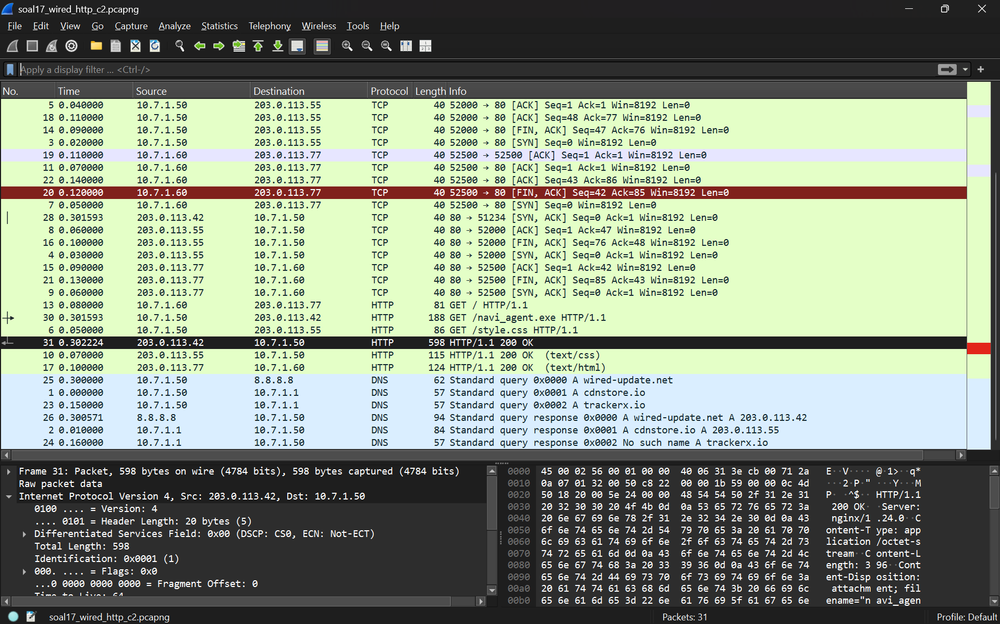

    Langsung follow Stream : 
    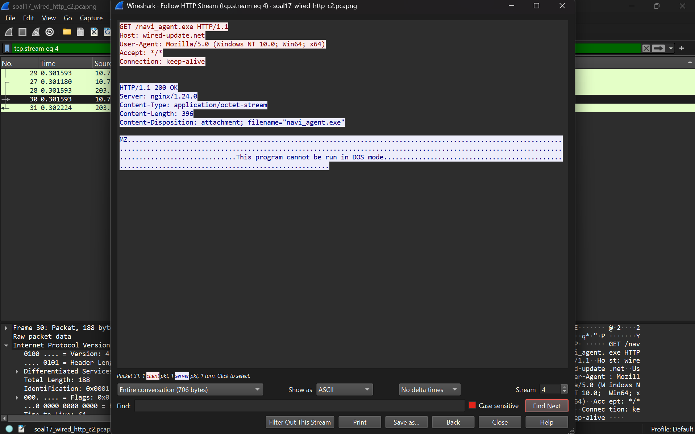

    Masukin datanya :
    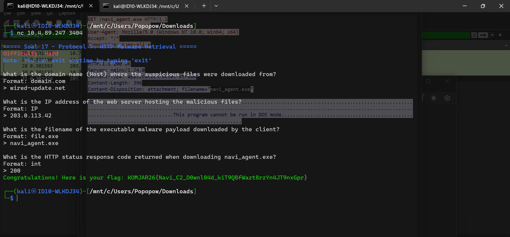

    Dapat flag  : KOMJAR26{Navi_C2_D0wnl04d_kiT9QBfWazt8rzYn4JT9nxGpr}


18. Eiri mengubah taktik penyerangan dengan menanamkan file malware menggunakan protokol file sharing SMB. Analisis file capture wired_smb_transfer.pcapng untuk mengidentifikasi nama protokol jaringan yang dieksploitasi, IP pengirim dan penerima, folder tujuan penyimpanan malware pada sistem korban, serta nama file executable malware yang ditransfer. Validasi temuan kalian pada socket server:
(link file) nc [IP_Group] 3405

    Sangat jelas Ip 10.7.3.100 meminta request untuk write, kemungkinan besar ini uploud file trojan. 
    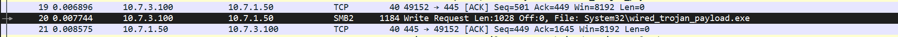

    Masukkan data : 
    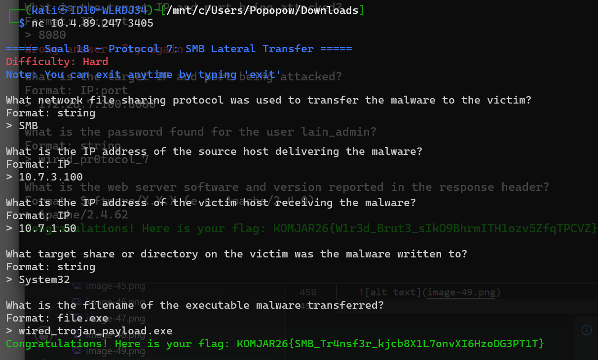

    Yeay dapat Flag :
    KOMJAR26{SMB_Tr4nsf3r_kjcb8X1L7onvXI6HzoDG3PT1T}

19. Eiri meneror jaringan dengan mengirimkan email pemerasan melalui protokol SMTP tanpa enkripsi. Analisis file capture wired_smtp_threat.pcap pada stream TCP terkait, identifikasi alamat email korban yang ditargetkan, password korban yang diklaim bocor oleh penyerang, jenis malware yang diinfeksikan, batas waktu (dalam hari) yang diberikan, serta MailClientID yang tercantum pada pesan. Validasi temuan kalian pada socket server.

    Filter Wireshark dengan protocol SMTP karena yang kita cari dlaam format Email : 
    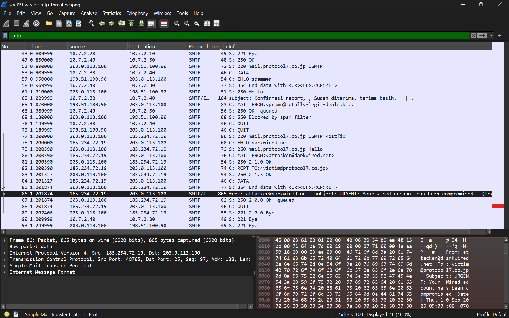

    Terlihat ada aktivitas tak umum pada baris ini :
    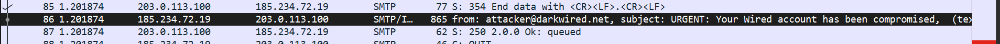

    Lakukan follow stream : 
    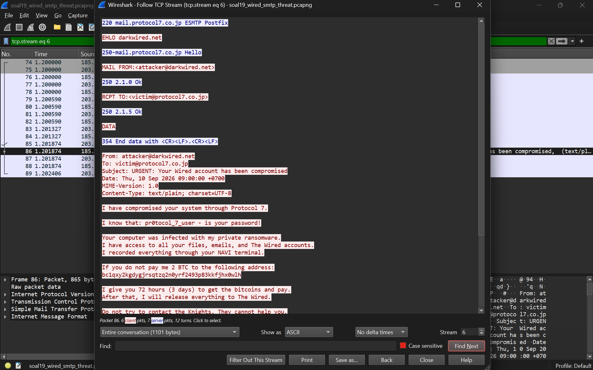

    Zaaaaaaaaaaaaaaaar!!! ditemukan data yang kita cari semuanya.

    Masukkan datanya : 
    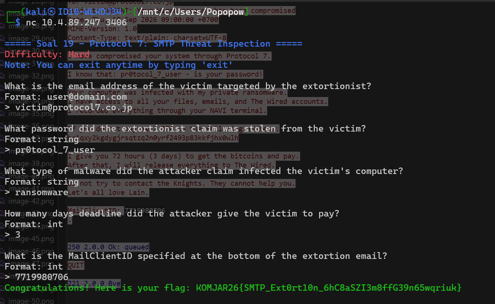

    Dapat Flag Cuy: 
    KOMJAR26{SMTP_Ext0rt10n_6hC8aSZI3m8ffG39n65wqriuk}

20. Untuk rencana pamungkasnya, Eiri menyembunyikan komunikasi malware di balik saluran terenkripsi TLS. Namun Alice telah menyediakan file keylog untuk mendekripsi lalu lintas data tersebut. Analisis file capture wired_tls_decrypt.pcapng bersama keyslogfile.txt untuk mengidentifikasi versi protokol TLS yang dinegosiasikan, nama domain (SNI) yang diakses, alamat IP server HTTPS penyerang, User-Agent yang digunakan, serta HTTP request method dan path yang tersembunyi di dalam sesi dekripsi. 

    Bisa kalian lihat kalau ada enkripsi : 
    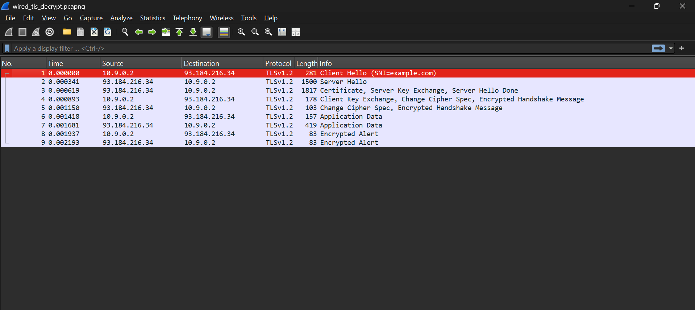

    Buat bukanya tinggal masukkan keylogfile.txt ke protocol TLS yang ada di wireshark :
    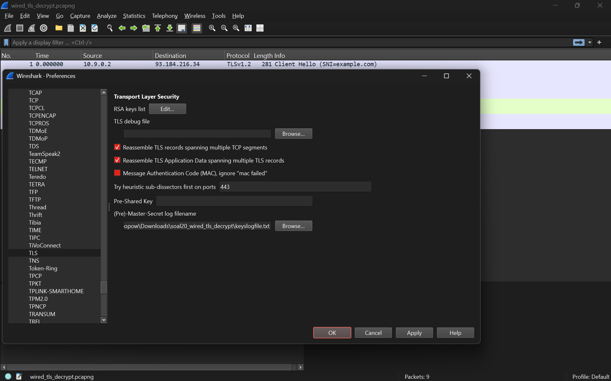

    Sekarang setelah didecode hasilnya langsung IJO KING :
    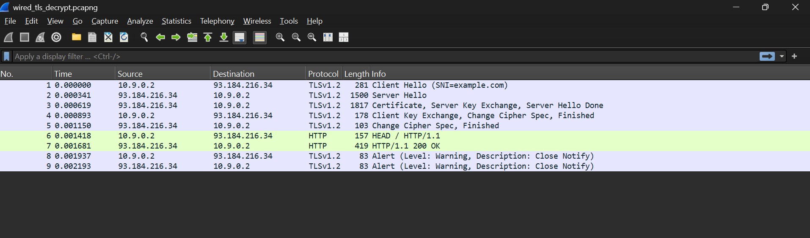

    Langsung kita Unboxing pakai Follow TLS stream: 
    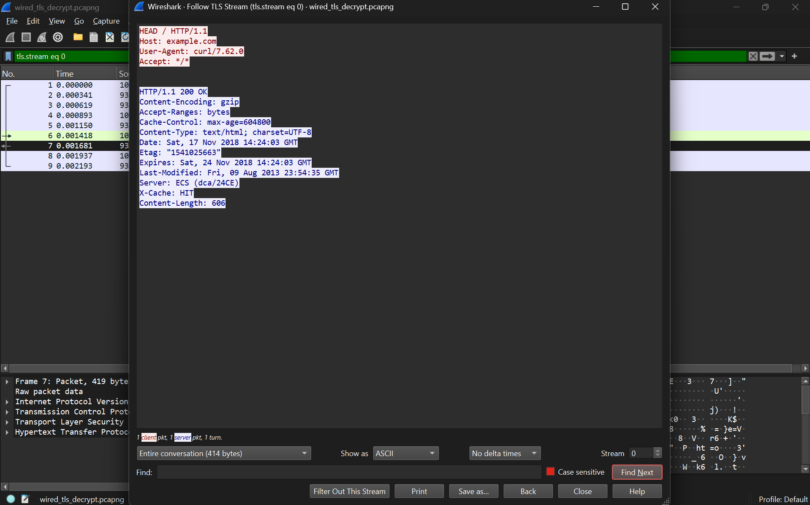

    Masukkan datanya :
    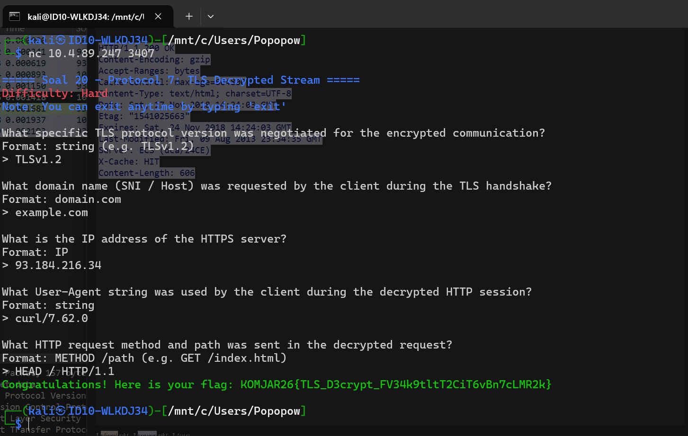

    Dapat Flag :
    KOMJAR26{TLS_D3crypt_FV34k9tltT2CiT6vBn7cLMR2k}


